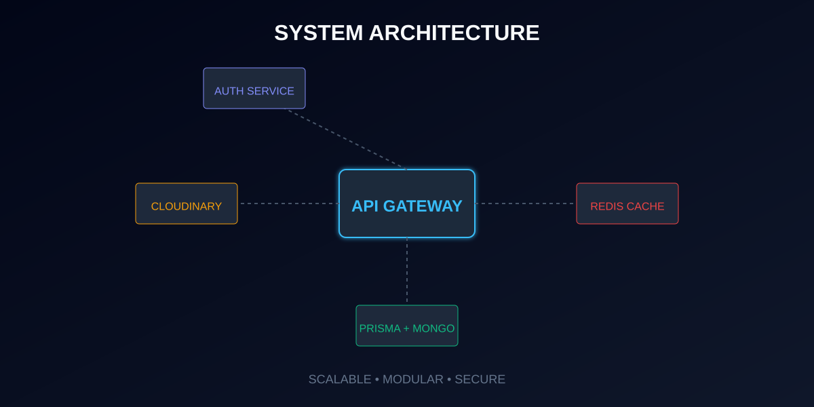

# 🛠️ Advanced Documentation: Architecture & Implementation

This document provides a technical deep-dive into the architectural decisions and advanced features implemented in the **IdkbroButthat-sisthelife** backend.

## 🏗️ Architectural Overview

The system follows a modular **Service-Layer Architecture**, ensuring clean separation of concerns and high maintainability.

### 📁 Directory Structure

- `src/index.ts`: Application entry point and server configuration.
- `src/routes/`: Route definitions and endpoint mapping.
- `src/services/`: Core business logic and database interactions.
- `src/middleware/`: Global and route-specific security/utility handlers.
- `src/mongodb/`: Mongoose models and MongoDB specific configurations.
- `prisma/`: Prisma schema and migration definitions.

## 🔐 Advanced Authentication Flow

### Google OAuth 2.0 Integration
The system implements a robust OAuth flow using `passport-google-oauth20`.
1. **Initiation**: User hits `/auth/google`.
2. **Callback**: Google redirects to `/auth/google/callback`.
3. **Synchronization**: The system checks if the user exists in MongoDB via Prisma; if not, a new user is provisioned.
4. **Session/Token**: A JWT is issued or a session is established for subsequent requests.

### JWT Security
- Tokens are signed using `jsonwebtoken` with HS256.
- Implementation includes cookie-based token delivery for enhanced CSRF protection.

## 🚀 Performance Optimization

### Redis Caching Strategy
We use Redis to minimize database load:
- **Session Store**: Managing active user sessions.
- **Query Caching**: Frequent database queries are cached with a configurable TTL (Time To Live).
- **Rate Limiting**: (Optional implementation) Prevents API abuse using Redis counters.

## ☁️ Media Management with Cloudinary

The project utilizes a custom `multer-storage-cloudinary` engine.
- **On-the-fly Transformation**: Images are automatically optimized and resized upon upload.
- **Secure Uploads**: Multer middleware handles file validation (size, mimetype) before sending to the cloud.

## 🛠️ Database Management (Prisma + MongoDB)

This project leverages the **Prisma Accelerate** and **Prisma Client** for MongoDB.
- **Type Safety**: Automatic type generation for all models.
- **Filtering & Pagination**: Advanced querying capabilities built-in.
- **Relations**: Managing document references with relational-like syntax.

## 🔄 Background Processing

The system includes a dedicated `cron` service for:
- Periodic data cleanup.
- Sending scheduled email notifications.
- Syncing external data sources.

## 🧪 Development Workflow

### Scripts
- `npm run dev`: Starts the server with `nodemon` and `ts-node` for instant feedback.
- `npx prisma studio`: Visual interface to manage your database records.

---
> [!TIP]
> Always ensure your `.env` variables are correctly set before starting the services. For production, consider using a managed Redis instance like Upstash or Redis Labs.
